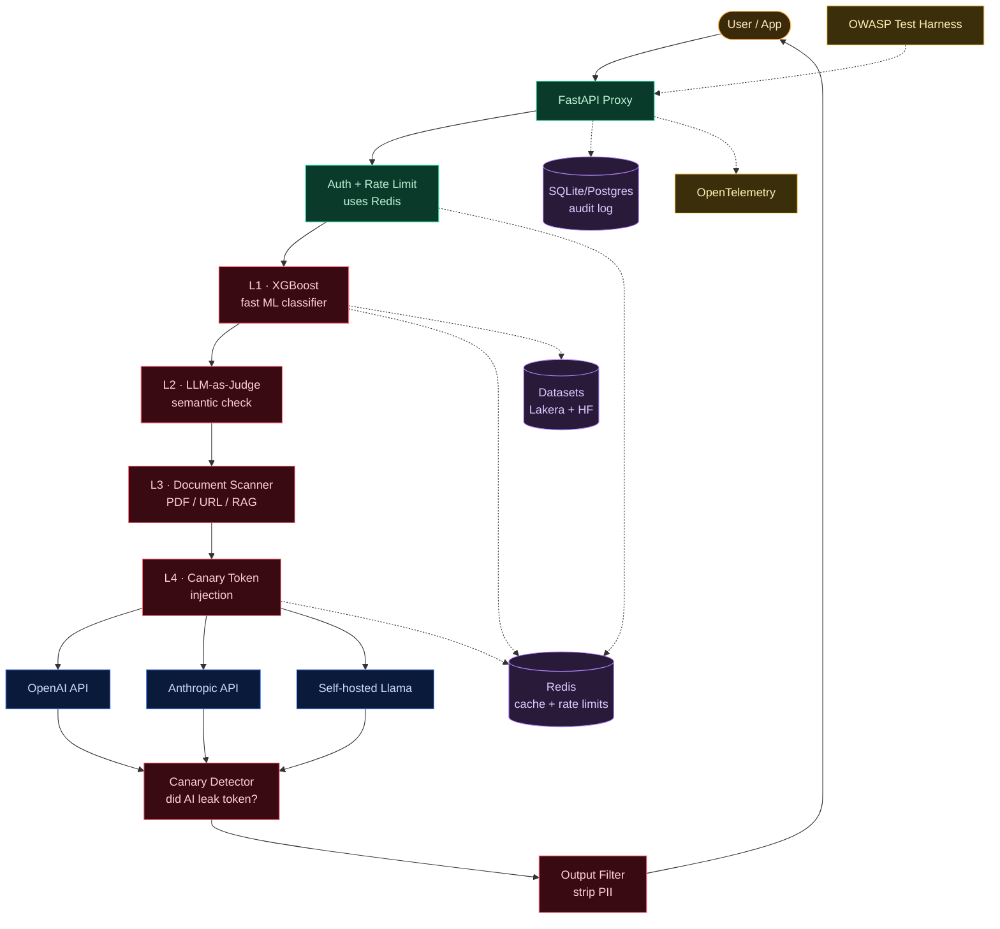
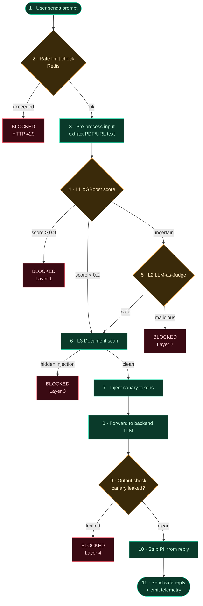
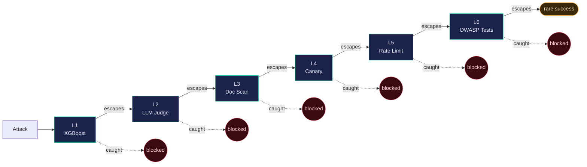

# Project 4 — AI Firewall: Architecture & Flow

> **LLM Application Security Gateway** — a layered defence pipeline that proxies traffic between users and AI models, blocking prompt injection, jailbreaks, and data exfiltration.

| | |
|---|---|
| **Duration** | 6 weeks (8-week plan) |
| **Difficulty** | Advanced |
| **Prerequisites** | FastAPI · XGBoost |
| **Target role** | AI Security / LLM Red-Team |

---

## Table of contents

1. [The big picture](#1--the-big-picture)
2. [Life of a single request](#2--life-of-a-single-request)
3. [Swiss-cheese layered defence](#3--swiss-cheese-layered-defence)
4. [Key design decisions](#4--key-design-decisions)
5. [Component glossary](#5--component-glossary)

---

## 1 · The big picture

Every box is a separate piece of the system. Read top → bottom. Arrows show where a request travels.



### ASCII fallback (if Mermaid does not render)

```
                    ┌─────────────┐
                    │  User / App │
                    └──────┬──────┘
                           │
                    ┌──────▼──────┐
                    │  FastAPI    │
                    │   Proxy     │
                    └──────┬──────┘
                           │
                    ┌──────▼──────┐         ┌──────────┐
                    │ Auth + Rate │ ◄─────► │  Redis   │
                    │   Limit     │         └──────────┘
                    └──────┬──────┘
                           │
              ┌────────────▼────────────┐
              │   DETECTION PIPELINE    │
              │ ─────────────────────── │
              │  L1  XGBoost            │
              │  L2  LLM-as-Judge       │
              │  L3  Document Scanner   │
              │  L4  Canary Injection   │
              └────────────┬────────────┘
                           │
        ┌──────────────────┼──────────────────┐
        ▼                  ▼                  ▼
   ┌────────┐         ┌─────────┐       ┌──────────┐
   │ OpenAI │         │Anthropic│       │  Llama   │
   └────┬───┘         └────┬────┘       └────┬─────┘
        └──────────────────┼─────────────────┘
                           │
                    ┌──────▼──────┐
                    │   Output    │
                    │   Check     │
                    │ (canary +   │
                    │  PII strip) │
                    └──────┬──────┘
                           │
                    ┌──────▼──────┐
                    │  User / App │
                    └─────────────┘
```

---

## 2 · Life of a single request

Follow one user prompt as it travels through the firewall.
**Yellow** = decision step. **Red** = blocked. **Green** = success.



### Step-by-step (plain English)

| # | Step | What happens |
|---|------|---------------|
| **1** | User sends a prompt | Hits FastAPI endpoint `/v1/chat`. Example: *"Summarise this PDF I uploaded."* |
| **2** | Rate limit check | Has this user sent too many requests this minute? Counter lives in Redis. Block if exceeded. |
| **3** | Pre-process | If attachments exist (PDF, URL), extract their text using PyPDF / a web fetcher. |
| **4** | **L1 — XGBoost score** | Returns 0.0 → 1.0. `> 0.9` block, `< 0.2` pass, in-between go to L2. |
| **5** | **L2 — LLM-as-judge** | A second AI reads borderline prompts and gives a verdict. Block if malicious. |
| **6** | **L3 — Document scan** | Look for hidden text, white-on-white text, "ignore previous" patterns inside attached docs. |
| **7** | **L4 — Inject canary tokens** | Plant 1-2 fake "secret" strings in the system prompt. We watch for them in the reply. |
| **8** | Forward to backend | Send cleaned prompt to OpenAI / Anthropic / self-hosted Llama. |
| **9** | Output check | Did the AI's reply contain any canary token? If yes → it was tricked → block. |
| **10** | Output filter | Strip leftover PII (emails, phone numbers, internal URLs). |
| **11** | Send safe reply | Plus emit telemetry via OpenTelemetry → audit log + OWASP report. |

---

## 3 · Swiss-cheese layered defence

No single detector is perfect — each layer has gaps. But when stacked, the gaps **don't line up**. An attack must beat **every** layer to succeed.



### Layer responsibilities

| Layer | Name | Speed | Catches |
|-------|------|-------|---------|
| **L1** | XGBoost classifier | < 10 ms | Known jailbreaks, repeat patterns |
| **L2** | LLM-as-judge | 500 – 2000 ms | Paraphrased / novel attacks |
| **L3** | Indirect injection scanner | ~50 ms | Poisoned PDFs, hidden text in RAG |
| **L4** | Canary-token tripwire | ~5 ms | Data exfiltration, system-prompt leaks |
| **L5** | Rate limiting | < 1 ms | Brute-force probing, abuse |
| **L6** | OWASP test harness | runs in CI | Regressions, broken defences |

---

## 4 · Key design decisions

The "why" behind the diagrams above.

### Why fast L1 before slow L2?

XGBoost classifies in **< 10 ms**. The LLM-judge takes **500 – 2000 ms** and costs API tokens. Most prompts (~95 %) are obviously fine, so we filter them out cheaply at L1. Only the uncertain ~5 % pay for the expensive L2 check. This saves **money** and **latency**.

### Why scan documents (L3)?

In RAG applications, the most dangerous attacks come **not** from the user but from documents the AI loads (the bank PDF story is exactly this). L1 + L2 only see the user's text — they can't catch hidden text inside an attached PDF. L3 is dedicated to that.

### Why canary tokens (L4)?

No detector can read the AI's mind to know its intent. Canary tokens flip the problem: instead of *guessing* intent, we leave **bait**. If the AI ever speaks the bait into its reply, we know something went wrong — even without knowing what.

### Why three different LLM backends?

Real production systems are multi-vendor for cost, reliability, and privacy. Showing the firewall handles **all three** (OpenAI + Anthropic + self-hosted Llama) makes the project realistic for a hiring manager.

### Why Redis instead of Postgres for rate limits?

Rate limiting needs sub-millisecond reads **per request**. Postgres is too slow for that. Redis is in-memory and gives **< 1 ms** reads. Postgres is used only for the slower audit log.

### Why a CI test harness (L6)?

The defences mean nothing if they silently break in a future code change. The OWASP test harness re-runs every known attack on **every commit** — like unit tests, but for security. This is what makes the system *production-grade* instead of a toy.

---

## 5 · Component glossary

Quick reference of every box in the architecture diagram.

### Client tier
| Component | Description |
|-----------|-------------|
| **User / App** | Anyone calling the gateway: a web app, mobile app, or another API. |

### Gateway tier
| Component | Description |
|-----------|-------------|
| **FastAPI Proxy** | The front door. Single Python service that receives every request and returns every response. |
| **Auth + Rate Limit** | Verifies the API key and counts requests per user using Redis. Built in W1 + W7. |

### Detection tier (the "AI firewall" itself)
| Component | Built in | Description |
|-----------|----------|-------------|
| **L1 XGBoost** | W2 | Fast ML classifier — outputs 0.0–1.0 maliciousness score. Trained on Lakera Gandalf + HuggingFace datasets. |
| **L2 LLM-as-Judge** | W3 | Second LLM that reads borderline prompts and decides if they are an attack. |
| **L3 Document Scanner** | W4 | Scans uploaded PDFs, URL contents, and RAG chunks for hidden injections. |
| **L4 Canary Tokens** | W5 | Plants fake secrets in the system prompt; flags any reply that contains them. |
| **Output Filter** | W5 | Strips PII (emails, phone numbers, internal URLs) from replies. |

### Backend tier
| Component | Description |
|-----------|-------------|
| **OpenAI API** | Paid commercial LLM (GPT models). |
| **Anthropic API** | Paid commercial LLM (Claude models). |
| **Self-hosted Llama** | Open-source LLM running on your own machine. Built in W7. Free. |

### Storage tier
| Component | Description |
|-----------|-------------|
| **Redis** | In-memory store. Holds rate-limit counters, classifier cache, canary token registry. |
| **SQLite / Postgres** | Persistent audit log of every prompt + verdict. Used to build the OWASP report. |
| **Datasets** | Lakera Gandalf + HuggingFace prompt-injection datasets used to train XGBoost. |

### Observability tier
| Component | Description |
|-----------|-------------|
| **OpenTelemetry** | Industry-standard logs, metrics, and traces emitted from every layer. |
| **OWASP Test Harness** | CI pipeline that runs every known attack on every code change and produces a 1-page posture report. Built in W6. |

---

## Build timeline (recap)

| Week | Deliverable |
|------|-------------|
| **W1** | FastAPI proxy scaffold + LLM backend integration |
| **W2** | XGBoost classifier on prompt-injection datasets |
| **W3** | LLM-as-judge secondary detector |
| **W4** | Indirect injection scan (PDF/URL content) |
| **W5** | Canary-token tripwires for exfiltration |
| **W6** | OWASP LLM Top-10 automated test harness |
| **W7** | Self-hosted Llama integration + rate limiting |
| **W8** | Red-team report + benchmark publication |

---

*Prepared for Suliman Khan · Advanced DevSecOps Portfolio · Project 04*
